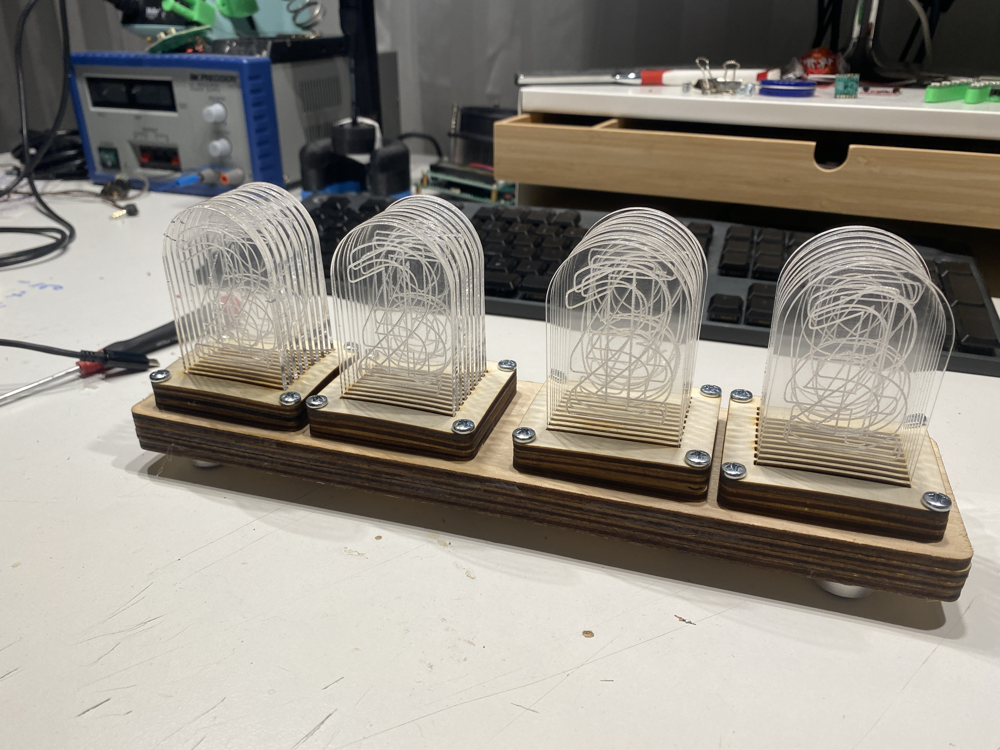

# MSFHAC_LixieClock
a simple and smart lixieclock design for the FH Aachen Makerspace

# NEEDED TOOLS

* soldering iron
* solder + flux
* wood glue
* philis screw driver
* small zip ties

# NEEDED PARTS

* LASERCUT PARTS, SEE `README.md` IN `./src/svg/`
* *  4x `./src/svg/4x_numbers_2mm_set_300_200` - acrylglas gs 2mm, engrave (blue lines), cut (red lines)
* *  1x `./src/svg/4_digit_combined_set_1` - playwood 4mm, cut (red lines)
* *  1x `./src/svg/4_digit_combined_set_2` - playwood 4mm, cut (red lines)
* *  1x `./src/svg/4_digit_combined_set_3` - playwood 4mm, cut (red lines)

* 16x `M4x30 Philips Head Type PH2 - DIN7985`
* 16x `M4 Nut - DIN934`
* 4x LED PCB, SEE `./src/pcb`, POPULATED BOTTOM SITE
* 1x ESP8266 D1 Mini or CONTROL PCB, SEE `./src/pcb`, POPULATED TOP SITE

## ADDITIONAL PARTS

* 8* `1*3 2.54mm MALE HEADERS`
* 24x `Jumperwires FEMALE<=>FEMALE`

# PICTURES

## BUILD INSTRUCTIONS
