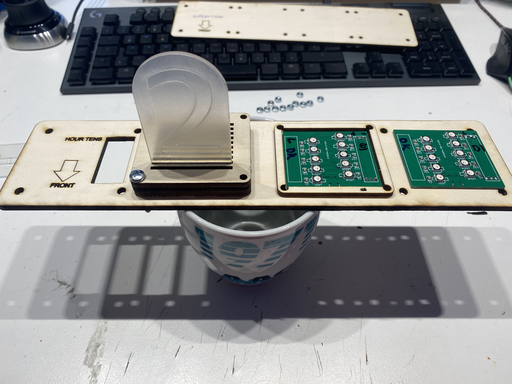

# MSFHAC_LixieClock

Die Lixie-Uhr des Makerspace der FH Aachen

# WERKZEUG

* Lötkolben + Lötzinn
* Philips-Kopf Schraubendreher
* Kleine Kabelbilder
* [OPTINAL] Heißkleber
* Glasreiniger

# TEILELISTE

## MECHANICAL

* LASERCUT TEILE
* *  4x `./src/svg/4x_numbers_2mm_set_300_200` - acrylglas gs 2mm, engrave (blue lines), cut (red lines)
* *  1x `./src/svg/4_digit_combined_set_1` - playwood 4mm, cut (red lines), engrave (blue lines)
* *  1x `./src/svg/4_digit_combined_set_2` - playwood 4mm, cut (red lines), engrave (blue lines)
* *  1x `./src/svg/4_digit_combined_set_3` - playwood 4mm, cut (red lines), engrave (blue lines)

* 16x `M4x30 Philips Head Type PH2 - DIN7985`
* 16x `M4 Nut - DIN934`

## ELECTRICAL

* 4x LED PCB, SEE `./src/pcb`, LED SEITE BESTÜCKT
* 1x ESP8266 D1 Mini
* 8* `1*3 2.54mm  90° MALE HEADERS`
* 4x 3x`Jumperwires FEMALE<=>FEMALE`

## BUILD INSTRUCTIONS

### 1. LED MODULE VORBEREITEN

Jedes LED Modul besteht aus drei Schichten:

* 4x 10x Arcyglglas Ziffern
* 4x 1x Sperrholz Ziffern-Halter
* 4x 1x Sperrholz Lightguide

Zuerst wird die Schtzfolien von den einzelnen Ziffern entfernt und anschließend mit Glasreiniger entfettet.
Ab jetzt dürfen die Ziffern nur noch an den Seiten angefasst werden, denn nach der Montage in die Halterung kommt man nur noch sehr schwer an die Flächen.

Jetzt werden sie einzelnen Ziffern in den `Ziffern-Halter` eingesetzt. Dabei müssen diese mit der gravierten Seite alle  in die gleiche Richtung zeigen.
Auch ist die Reihenfolge wichtig!
Von hinten nach vorne, sind die Ziffern in dieser Reihenfolge einzusetzten:

`0` - `9`- `8` - `7` - `6` - `5` - `4` - `3` - `2` - `1`  

Anschließend werden die Ziffern auf den `Lighguide` gesetzt. Dabei muss die gravierte Seite der Ziffern in  Richtung der `FRONT` Markierung zeigen und die Markierungen auf dem `Lightguide` müssen mit den Ziffern übereinstimmen.

Dieser Prozess, wird für alle vier Ziffern-Blöcke wiederholt.

#### NOTE

Sollte bei den vier `LED-PCB`s die zwei Stiftleisten nicht bestückt sein, muss dies zuerst geschehen.
Dazu werden diese in die beiden vorgesehenden 1x3 Pin Bohrungen gesteckt. Diese sind auf der Platine mit `H1` und `H2` beschriftet.
Die lange Seite der Stiftleisten zeigt dabei von der LED Seite weg.

### 2. Zusammenbau Oberseite

Nachdem alle vier Module soweit vorbereitet wurden, können diese nun mit der oberen Bodenplatte zusammengeschraubt werden.
Dabei wird auch die LED PCB und der `PCB Spacer` zusätzlich benötigt.

* 4x PCB Spacer
* 4x LED_PCB mit Bestückter LED Seite
* 4x Top-Cover

Für den Zusammenbau, wird das `TOP_COVER` mit der Beschriftung nach oben gelegt und die `LED-PCB`s mit den Stiftleisten ind die Aussüarungen gelegt.

**WICHTIG ** Die `FRONT` Markeierung auf dem `TOP_COVER` und der Pfeil zeigt dabei zur Tischkante!

Diese werden dadurch nicht flach auf dem Tisch liegen, es Empfiehlt sich das `TOP_COVER` dafür auf eine Tasse zu stellen.

Anschließend wird auf jede `LED_PCB` der Sperrholz `PCB_SPACER` gelegt, hier ist die Ausrichtung nicht relevant.
Als letztes wird das im ersten Schritt zusammengebaute Ziffern-Modul auf den `PCB_Spacer` gesetzt.
Dabei ist die Ziffer `1` die vorderste Ziffer (richtung der `FRONT` MARKIERUNG).
Nach dem Platzieren der vier Ziffern-Module, sollten diise jeweils mit zwei der `M40x30` Schrauben und `M4` Mutter gesichert werden.
Hier reicht es diese nicht ganz fest anzuziehen. Dieser Schritt erleichter die Montage im folgendnen Schritt.

### 3. Montage Elektronik

