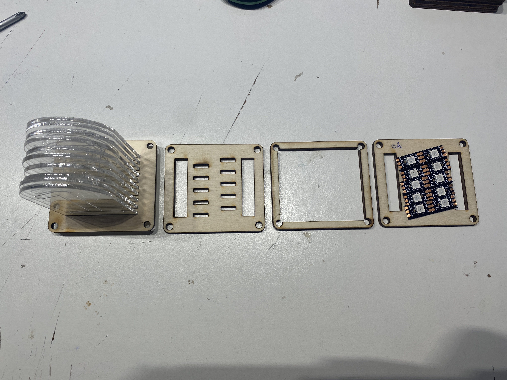

# MSFHAC_LixieClock

Die Lixie-Uhr des Makerspace der FH Aachen

# WERKZEUG

* Lötkolben + Lötzinn
* Philips-Kopf Schraubendreher
* Kleine Kabelbilder
* [OPTINAL] Heißkleber

# TEILELISTE

## MECHANICAL

* LASERCUT TEILE
* *  4x `./src/svg/4x_numbers_2mm_set_300_200` - acrylglas gs 2mm, engrave (blue lines), cut (red lines)
* *  1x `./src/svg/4_digit_combined_set_1` - playwood 4mm, cut (red lines), engrave (blue lines)
* *  1x `./src/svg/4_digit_combined_set_2` - playwood 4mm, cut (red lines), engrave (blue lines)
* *  1x `./src/svg/4_digit_combined_set_3` - playwood 4mm, cut (red lines), engrave (blue lines)

* 16x `M4x30 Philips Head Type PH2 - DIN7985`
* 16x `M4 Nut - DIN934`

## ELECTRICAL

* 4x LED PCB, SEE `./src/pcb`, LED SEITE BESTÜCKT
* 1x ESP8266 D1 Mini
* 8* `1*3 2.54mm  90° MALE HEADERS`
* 4x 3x`Jumperwires FEMALE<=>FEMALE`

## BUILD INSTRUCTIONS

### 1. LED MODULE VORBEREITEN

Jedes LED MOdul besteht aus drei Schichten:

* 10x Arcyglglas Ziffern
* 1x Sperrholz Ziffern-Halter
* 1x Sperrholz Lightguide
* 1x PCB Spacer
* 1x PCB mit Bestückter LED Seite

