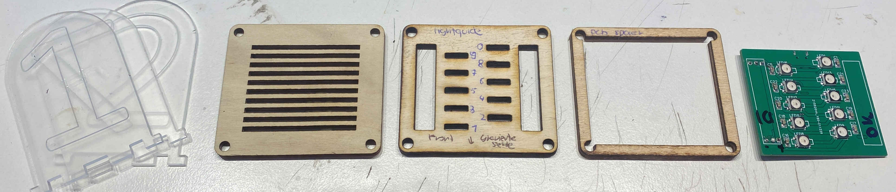
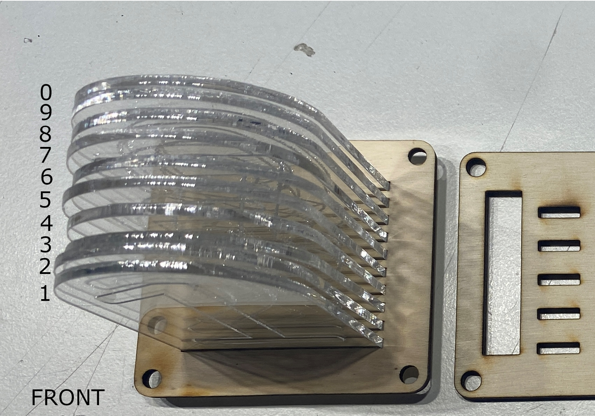

# MSFHAC_LixieClock

Die Lixie-Uhr des Makerspace der FH Aachen


# WERKZEUG

* Lötkolben + Lötzinn
* Philips-Kopf Schraubendreher
* Kleine Kabelbilder
* Heißkleber
* Glasreiniger
* Mikro-USB Kabel
* [OPTINAL] Holzkleber

# TEILELISTE

## BILD ZEIGT ALTE REVISION


## MECHANICAL

* LASERCUT TEILE
* *  4x `./src/svg/4x_numbers_2mm_set_300_200` - acrylglas gs 2mm, engrave (blue lines), cut (red lines)
* *  1x `./src/svg/4_digit_combined_set_1` - playwood 4mm, engrave (blue lines), cut (red lines)
* *  1x `./src/svg/4_digit_combined_set_2` - playwood 4mm, engrave (blue lines), cut (red lines)
* *  1x `./src/svg/4_digit_combined_set_3` - playwood 4mm, engrave (blue lines), cut (red lines)

* 3D DRUCK
* * [OPTINAL] 4x `./src/3d_print/4x_lixie_feet.stl` - 0.2mm PLA

* MISC
* * 16x `M4x30 Philips Head Type PH2 - DIN7985`
* * 16x `M4 Nut - DIN934`
* * [OPTINAL] 4x `M4 THREAD INSERTS`


## ELECTRICAL

* 4x `LED_PCB`, SEE `./src/pcb`, LED SEITE BESTÜCKT
* 1x `ESP8266 D1 Mini`
* 8* `1*3 2.54mm  90° MALE HEADERS`
* 4x 3x`Jumperwires FEMALE<=>FEMALE`


## SOFTWARE 

* Arduino IDE


## BUILD INSTRUCTIONS


### 0. PROGRAMMIERUNG BASIS-PROGRAMM

Zum späteren Funktionstest wird hier zuerst der `ESP8266 D1 Mini` programmiert.
Somit kann die vollständige  Funktionalität vor dem finalen Zusammenbau überprüft werden.

Hierzu sollte die Arduino IDE installiert und dieses Git-Repository heruntergeladen sein.
Unter Linux kann dies wie folgt geschehen:

```bash
# ###### LINUX INSTALL ######
$ sudo apt update && sudo apt install -y git xz-utils

# CLONE REPOSITORY
$ cd ~ && git clone https://github.com/RBEGamer/LixieClock ./LixieClock

# INSTALL ARDUINO IDE
$ wget https://downloads.arduino.cc/arduino-1.8.19-linux64.tar.xz
$ tar -xf arduino-1.8.19-linux64.tar.xz
$ cd arduino-1.8.19-linux64 && bash ./install.sh

# ALLOW USB COMMUNICATION
$ sudo usermod -a -G dialout $USER
$ sudo reboot
```

Nach dem Neustart kann der `ESP8266 D1 MINI` per USB Kabel mit dem Computer verbunden werden.

Das Demo-Programm der Uhr, welches eine vollständige über NTP Synchronisierte Uhr darstellt, benötigt einige Bibliotheken.
Diese könne über den Library-Manager der Arduino IDE installiert werden oder aus diesem Repository kopiert werden.
Unter Windows wird der Inhalt des Ordners `./src/required_libs` nach `BENUTZER_VERZEICHNIS/Dokumente/Arduino/libraries` kopiert.

Unter MacOS und Linux befindet sich der `Arduino`-Ordner direkt im Benutzer-Ordner `~/`.
Unter Linux muss aufgepasst werden, wie die Arduino IDE installiert wurde.
Wurde `snap install arduino` verwendet, befindet sich der Library-Order im Snap Verzeichnis `~/.snap/arduino/current/library`.

```bash
# ###### LINUX LIB COPY ######
$ cd ~
$ cp -Rf ./LixieClock/src/required_libs ~/Arduino/libraries
```

Anschließend kann die Arduino IDE geöffnet werden.

Unter `Datei -> Öffnen` kann das Programm geöffnet werden, dies befindet sich in diesem Repository unter dem Pfad `./src/lixieclock/lixieclock.ino`

Unter den Einstellungen muss danach zuerst der Support für den `ESP8266` geladen werden.
Hierzu wird unter dem Punkt `Zusätzliche Boardverwalter-URLs` die folgende Zeile hinzugefügt:

* `https://arduino.esp8266.com/stable/package_esp8266com_index.json`

#### NOTE

Falls ein `ESP32` verwendet wird muss diese hinzugefügt werden:

* `https://raw.githubusercontent.com/espressif/arduino-esp32/gh-pages/package_esp32_dev_index.json`

Allgemein ist die Software mit dem `ESP6266` (nicht `ESP6266-01`) und dem `ESP32` kompatibel.
#### END NOTE

Nach dem Speichern der Einstellungen muss das Board noch installiert werden.
Dazu wird unter `Werkzeuge -> Board -> Boardverwalter` der `ESP8266` installiert.
Anschlißend kann dieser als Board ausgewählt werden.


Unter `Port` wird der Serielle-Port ausgewählt, an welchem sich das Board befindet.

* Windows `COMx`
* MacOS `/dev/ttyXXxxxXXxxx`
* Linux `/dev/ttyUSBx`

Anschließend kann über `Sketch -> Hochladen` das Programm hochgeladen werden.


#### NOTE

Im Verzeichnis `./src/lixieclock__base` befindet sich ein Demo-Programm, welches nur die einzelne Segmente ansteuert.
Dies kann als Basis für eigene Projekte verwendet werden.
Mittels der Funktion `update_clock_display` können alle Segmente der Uhr einzeln verändert werden.
Zur Bestimmung der Farbe können die Funktionen `Wheel` und `digit_color` verwendet werden.

```c++
void update_clock_display(int h, int m, int s, int col, int _bright, bool _disable_leading_zero);
uint32_t Wheel(int WheelPos, int _bright);
uint32_t digit_color(int _val,int _index, bool _banked, int _base_color, int _bright);
```


### 1. LED MODULE VORBEREITEN



Jedes LED Modul besteht aus drei Schichten:

* 4x 10x Acryglas Ziffern
* 4x 1x Sperrholz Ziffern-Halter
* 4x 1x Sperrholz Lightguide


Zuerst wird die Schutzfolien von den einzelnen Ziffern entfernt und 
ließend mit Glasreiniger entfettet.
**Ab jetzt dürfen die Ziffern nur noch an den Seiten angefasst werden, denn nach der Montage in der Halterung kommt man nur noch sehr schwer an die Flächen.**

Jetzt werden sie einzelnen Ziffern in den `Ziffern-Halter` eingesetzt. Dabei müssen diese mit der gravierten Seite alle in die gleiche Richtung zeigen.
Auch ist die Reihenfolge wichtig, von hinten nach vorne, sind die Ziffern in dieser Reihenfolge einzusetzen:

`0` - `9`- `8` - `7` - `6` - `5` - `4` - `3` - `2` - `1`  




Anschließend werden die Ziffern auf den `Lighguide` gesetzt. Dabei muss die gravierte Seite der Ziffern in Richtung der `FRONT` Markierung zeigen und die Markierungen auf dem `Lightguide` müssen mit den Ziffern übereinstimmen.

Dieser Prozess, wird für alle vier Ziffern-Blöcke wiederholt.


#### NOTE


Sollte bei den vier `LED-PCB`s die zwei Stiftleisten nicht bestückt sein, muss dies zuerst geschehen.
Dazu werden diese in die beiden vorgesehenen 1x3 Pin Bohrungen gesteckt. Diese sind auf der Platine mit `H1` und `H2` beschriftet.
Die lange Seite der Stiftleisten zeigt dabei von der LED Seite weg.

### 2. Zusammenbau Oberseite

Nachdem alle vier Module so weit vorbereitet wurden, können diese nun mit der oberen Bodenplatte zusammengeschraubt werden.
Dabei wird zusätzlich auch die `LED_PCB` und der `PCB Spacer` benötigt.

* 4x PCB Spacer
* 4x LED_PCB mit Bestückter LED Seite
* 4x Top-Cover


Für den Zusammenbau wird das `TOP_COVER` mit der Beschriftung nach oben gelegt und die `LED-PCB`s mit den Stiftleisten in die Aussparungen gelegt.

**WICHTIG** Die `FRONT` Markierung auf dem `TOP_COVER` und der Pfeil zeigt dabei zur Tischkante!

Diese werden dadurch nicht flach auf dem Tisch liegen, es Empfiehlt sich das `TOP_COVER` dafür auf eine Tasse zu stellen.


Anschließend wird auf jede `LED_PCB` der Sperrholz `PCB_SPACER` gelegt, hier ist die Ausrichtung nicht relevant.
Als letztes wird das im ersten Schritt zusammengebaute Ziffern-Modul auf den `PCB_Spacer` gesetzt.
Dabei ist die Ziffer `1` die vorderste Ziffer (Richtung der `FRONT` MARKIERUNG).
Nach dem Platzieren der vier Ziffern-Module, sollten diise jeweils mit einer der `M40x30` Schrauben und `M4` Mutter gesichert werden.
Hier reicht es diese nicht ganz fest anzuziehen. Dieser Schritt erleichtert die Montage im folgenden Schritt.


### 3. Montage Bodenplatte


**Für diesen Schritt, wird alles umgedreht, sodass die LED Module mit der runden Seite auf der Tischplatte stehen.**
Die `FRONT` Markierung sollte jetzt in die andere Richtung Zeigen und somit das LED-Modul welches die Zehner-Stunden darstellen auf der linken Seite befinden.
Hier werden die folgenden Sperrholzteile benötigt:

* 1x `SPACER_TOP`
* 1x `SPACER_BOTTOM`

Diese dienen als Abstandshalter zwischen des `TOP_COVERS` und der Bodenplatte `BOTTOM_COVER`.
Am `SPACER_BOTTOM` befindet sich eine Aussparung für den `ESP8266 D1 MINI`.

#### OPTINAL 
Da diese beiden Teile leicht zerbrechlich sind bietet es sich an, diese mit etwas Holzleim zu verkleben.


Dabei wird der  `SPACER_TOP` auf den `SPACER_BOTTOM` geklebt und zu einfachen Arretierung dieser mit zwei Schrauben für 5 Minuten verschraubt.
Nach dieser Zeit können diese wieder gelöst werden.


#### END OPTIONAL


Die Schrauben (aus Schritt 2), welche die Module gehalten haben können jetzt wieder gelößt werden.
Die beiden Spacer (geklebt oder nicht), werden anschließend auf das `TOP_COVER` gesetzt, sodass sich die Aussparung unten links in der Ecke befindet und sich somit auf der Rückseite der Uhr befindet.
Anschließend können die Module wieder mit je einer Schraube fixiert werden. Somit sollten auch die beiden Spacer fixiert sein.


### 4. Montage Elektronik

Für die Verkabelung und Montage der Elektronik, wird alles umgedreht, sodass die LED Module mit der runden Seite auf der Tischplatte stehen.
Die `FRONT` Markierung sollte jetzt in die andere Richtung Zeigen und somit das LED-Modul welches die Zehner-Stunden darstellen auf der linken Seite befinden.
Für diesen Schritt werden die `Jumper-Wires`, sowie der `ESP8266 D1 MINI` benötigt.

Jetzt werden mit den 4x drei `Jumper-Wires` die einzelnen Module miteinander Verbunden. Auf den `LED-PCB`s sollten die Stiftleisten durch das `TOP_COVER` zugänglich sein. Bei diesen sind die einzelnen Pins beschriftet. Für `H1 => 5V D0 GND` und für `H2 => 5V DIN GND`.
Das Ziel ist es die einzelnen Platinen zu einer Kette zu verbinden. 
Angefangen von der Zehner-Stunden, wird die `H2`-Stiftleiste über drei `Jumper-Wires` mit der `H1`-Stiftleiste des Stunden-Einer-Moduls verbunden.
Dabei wird `5V->5V`, `GND->GND` und `DI->D0` verbunden.
Dieser Prozess wird anschließend noch zweimal wiederholt:

* Stunden-Zehner `H2` => Stunden-Einer `H1`
* Stunden-Einer `H2` => Minuten-Zehner `H1`
* Minuten-Zehner `H2` => Minuten-Einer `H1`

Nach diesem Schritt sind die Stiftleisten `Stunden-Zehner H1` und `Minuten-Einer H2` nicht verbunden.
Im letzten Schritt wird der `ESP8266 D1 Mini` mit der `Stunden-Zehner H1` verbunden.
Dabei werden die folgenden Pins am `ESP8266 D1 Mini` verbunden:

* `(ESP8266 D1 MINI) 5V` => `(Zehner Stunden H1) 5V`
* `(ESP8266 D1 MINI) D8` => `(Zehner Stunden H1) DIN`
* `(ESP8266 D1 MINI) GND` => `(Zehner Stunden H1) GND`

Anschließend kann vor dem finalen Zusammenbau die Funktion getestet werden.
Mit einem USB-Kabel wird der `ESP8266 D1 Mini` verbunden. Jede Ziffer sollte einmal aufleuchten.
Falls dies nicht der Fall ist, ist die Verkabelung zu Prüfen.

Um den Zusammenbau zu vereinfachen, werden die einzelnen Stiftleisten mit dem `Jumperwires` leicht zueinander (ca. 45°) gebogen und mit Heisskleber fixiert.
Auch die Kabel ziewschen den Elementen werden mit Kabelbindern und/oder Heißkleber an der `TOP_PLATE` fixiert.


### 5. Endmontage

Im letzten Schritt wird der `ESP8266 D1 Mini` in die Aussparung des Spacers mit Heißkleber geklebt, sodass der USB-Anschluss nach aussen zeigt.
Geklebt wird auf der glatten Seite des `ESP8266 D1 Mini` (auf der gegenüberliegenden Seite des USB-Anschluss).


Final kann die Bodenplatte `BOTTOM_COVER` montiert werden. Dazu werden die zuvor zur Montage genutzten Schrauben wieder gelöst und das `BOTTOM_COVER` auf die Spacer gelegt. Alle Schrauben werden dann handfest angezogen.


#### OPTIONAL

Anstatt der vier M4 Muttern an den Ecken können auch die 3D gedruckten Füße angeschraubt werden.
Dazu werden die  `M4 THREAD INSERTS` mit dem Lötkolben erwärmt und in die Bohrung des Fußes bündig einschmelzen.
Nach dem Abkühlen können die Muttern an den Ecken ersetzt werden.


### 6. Bedienung

Wenn die Uhr mit dem Basis-Programm programmiert wurde, agiert diese nach dem Starten als NTP-Synchronisierte Uhr.
Hierzu wird ein WLAN benötigt, mit welchem die Uhr einen Zeitserver abgragen kann.
Um dieses WLAN festzulegen, wird die Uhr normal mit Spannung versorgt. Mit einem anderen Endgerät z.B. dem Handy kann sich mit dem WLAN-Access-Point der Uhr verbunden werden.
Dieses heißt `LixieClockConfiguration`. Nach dem Verbinden mit diesem öffnet sich eine Konfigurationsübersicht, in der das WLAN gesetzt werden kann.
**Achtung** Nur 2.4 Ghz Netzwerke werden vom `ESP8266` und `ESP32` unterstützt.

**Anschließend die Uhr einmal neustarten!**

Nach einer erfolgreichen Verbindung, zeigt die Uhr ihre IP-Adresse auf den einzelnen Ziffern per Laufschrift an.
Wird diese Adresse in einem Browser aus dem gleichen Netz aufgerufen, kann diese umfassend konfiguriert werden.


